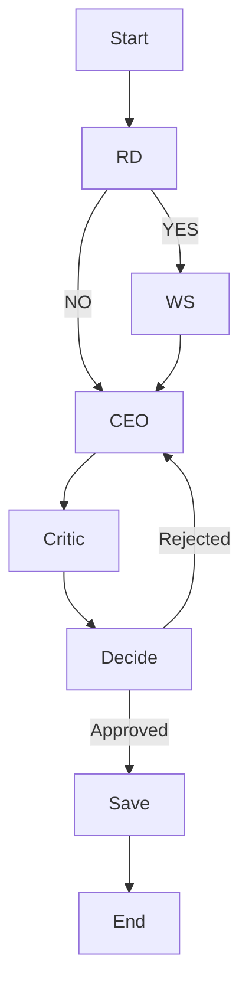

# 🚀 Agentic Startup AI Builder

An intelligent, multi-agent AI system designed to brainstorm, research, propose, and refine business startup strategies. By leveraging a team of specialized AI agents working in a dynamic loop, this application simulates a real-world startup incubation process, providing users with well-researched, critically evaluated business models.

---

## 🛠️ Tech Stack

- **Core Logic & Orchestration:** Python, [LangGraph](https://python.langchain.com/docs/langgraph)
- **Language Models:** Google Gemini (via `langchain-google-genai`)
- **Frontend / UI:** [Streamlit](https://streamlit.io/)
- **Vector Database (Memory):** [ChromaDB](https://www.trychroma.com/)
- **Web Research API:** [Tavily](https://tavily.com/)
- **Structured Outputs:** Pydantic

---

## 🧠 What are Agentic AI Systems?

Traditional AI applications are linear: you ask a question, and the model gives an answer. **Agentic AI Systems**, on the other hand, behave like autonomous workers. 

In a multi-agent workflow, different AI models are assigned specific "roles" (like a CEO or a Critic). They share a **Common Memory State** (a centralized dictionary or object) where they read inputs and append their outputs. Rather than a single prompt-response, the agents converse, pass data to one another, use tools (like web search), and operate in recursive loops until a specific condition or quality threshold is met.

### 🌐 Web Searching Tools
The system is equipped with the Tavily API, allowing the AI to break out of its training data and fetch real-time information from the internet. This ensures that market trends, competitor analysis, and pricing models reflect the current real-world landscape.

### 🗄️ Database Memory (ChromaDB)
To provide a cohesive experience across multiple sessions, the system uses **ChromaDB**, an open-source persistent vector database. If a user prompts the system to *"refer previous"*, the CEO agent will query ChromaDB to recall previously generated startup ideas and proposals, allowing the system to build upon past context rather than starting from scratch every time.

---

## 🔄 Multi-Agent Workflow & Decision Making

The application uses **LangGraph** to orchestrate a cyclical decision-making loop. Here is how the agents interact:

1. **Research Decision Agent:** Evaluates the user's idea and decides if a real-time web search is necessary (e.g., needed for competitor analysis, skipped for generic brainstorming).
2. **Web Search Agent (Optional):** If triggered, uses Tavily to scrape the web for market trends and competitors.
3. **CEO Agent:** Consumes the initial idea, web search results, and database memories to draft a comprehensive startup proposal.
4. **Critic Agent:** Reviews the CEO's proposal. It provides structured feedback (finding weaknesses) and assigns a score out of 10.
5. **Decision Loop:** If the score is high enough (Approved), the workflow moves to save the data. If rejected, the feedback is sent *back* to the CEO to rewrite the proposal. This loop continues until approval or a maximum of 3 iterations is reached.
6. **Save Memory:** The final approved proposal is embedded and saved to ChromaDB.

### Workflow Diagram



---

## 💻 Installation & Setup

Follow these steps to run the application locally on your machine.

### 1. Clone the repository
Ensure you have the project files locally and navigate to the project root directory.

### 2. Create a Virtual Environment
It's highly recommended to use a virtual environment to manage dependencies.
```bash
python -m venv venv
```
Activate the environment:
- **Windows:** `venv\Scripts\activate`
- **Mac/Linux:** `source venv/bin/activate`

### 3. Install Dependencies
Install all required packages from the `requirements.txt` file.
```bash
pip install -r requirements.txt
```

### 4. Setup Environment Variables
Create a file named `.env` in the root directory and add your API keys:
```env
GOOGLE_API_KEY=your_google_gemini_api_key_here
TAVILY_API_KEY=your_tavily_api_key_here
```

### 5. Run the Application
Launch the Streamlit frontend. The UI will open automatically in your default web browser.
```bash
streamlit run frontend/app.py
```
